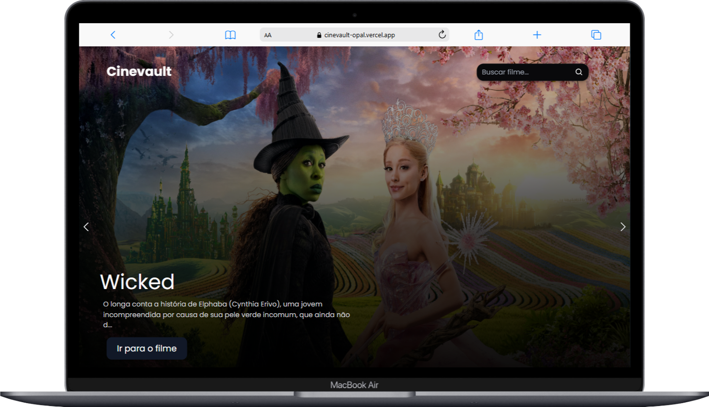

<h1 align='center'>🎥 CineVault</h1>

<h2>📜 Project Description</h2>

  Welcome to CineVault!  

  CineVault is a project that simulates a streaming platform, designed to showcase popular and trending movies, powered by The Movie Database (TMDB) API.

  I developed this application using React, TypeScript, and TailwindCSS, along with @tanstack/react-query for efficient data fetching and management.

<h2>Key Features</h2>

🎬 **Trending and Popular Movies:** 
The application displays a carousel of trending movies and sections featuring popular and top-rated movies fetched dynamically from the TMDB API.

📚 **Genre Filtering:**  
Browse movies by genres such as Action, Comedy, Drama, Horror, and more, making it easy to find your favorite type of content.

🔍 **Search Functionality:**  
Search for movies by title using the search bar, with support for manual or Enter-key search triggers.

📄 **Detailed Movie Information:**  
Get comprehensive details about a selected movie, including its overview, genres, runtime, release date, and even the official trailer embedded directly from YouTube.

📱 **Responsive Design:**  
Built with TailwindCSS, the interface is fully responsive and offers a seamless experience on any device, from mobile to desktop.

⚙️ **API Integration:**  
Efficiently fetches data using @tanstack/react-query for smooth and optimized API calls, minimizing redundant requests and enhancing user experience.

  CineVault highlights my skills in front-end development, including state management, API consumption, component-based architecture, and creating engaging user interfaces. This project demonstrates my ability to deliver responsive and scalable web applications. 🚀

### 🚀 Technologies Used:

    
    
    

### 📸 Preview

